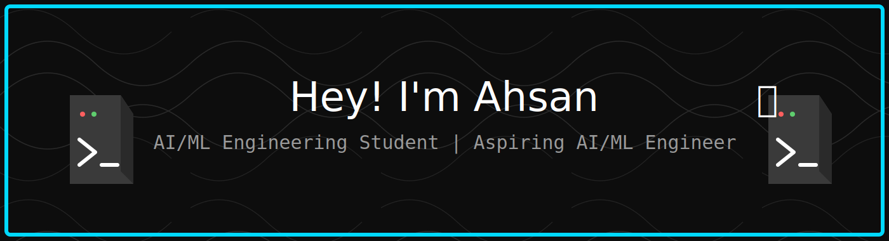

  

  

<h3 align="center">🚀 Artificial Intelligence & Machine Learning Engineer</h3>

---

### 🧠 About Me

- 🎓 **B.E. Computer Science & Engineering (AI/ML)** @ Loyola Institute of Technology and Science | Class of 2027
- 💻 **Core Focus:** Machine Learning Systems, LLM Applications, Fraud & Risk Analytics
- 🛠️ **Building:** Explainable fraud detection pipelines and full-stack AI products
- 🎯 **Goal:** Landing an MNC internship/role and mastering DSA + system design
- ⚡ **Current Mission:** Deepening DSA fundamentals and shipping polished AI portfolio projects

---

## 🛠️ Tech Stack

<!-- Divider -->

<!-- Main Stack Icons -->

  

<!-- Data Science (custom badges for missing icons) -->

  
  
  
  

<!-- Optional subtle animation line -->

  

---
### 🚀 Featured Projects

#### 🏦 FedXplain — Federated & Explainable Fraud Detection
- **Tech:** Python, FastAPI, XGBoost, SHAP, Federated Learning (FedAvg), Groq LLaMA 3.3 70B, React 19, TypeScript, Tailwind CSS
- Privacy-preserving fraud detection platform: simulated banks train a shared model via Federated Learning without ever sharing raw data, with SHAP + LLM-generated explanations (plain-English and Basel III-style audit narratives) for every prediction.
- JWT auth with role-based access control (Admin/Analyst/Auditor), real-time WebSocket alerts, model versioning, full audit logging.
- Grounded in and extending the open research gap identified in an IEEE Access systematic review on AI-driven fraud detection.
- Frontend on **Vercel**, backend on **Render**.
- [Live Demo](https://fed-xplain-lsu7.vercel.app) · [View Repository](https://github.com/ahsan-mohamed/FedXplain)

#### 🛡️ FraudGuard AI
- **Tech:** Python, XGBoost, Groq LLaMA 3.3 70B, Flask, React
- End-to-end fraud detection platform combining ML predictions with LLM-generated, human-readable explanations for flagged transactions.
- Frontend on **Vercel**, backend on **Render**.
- [Live Demo](https://fraudguard-ai-lovat.vercel.app/) · [View Repository](https://github.com/ahsan-mohamed/fraudguard-ai)

#### 🔐 Enterprise RAG System
- **Tech:** LangChain, ChromaDB, Flask, JWT/bcrypt, React
- Role-based access control RAG pipeline for enterprise document search, with a TF-IDF + LSA embedding fallback for compatibility.
- *Repo coming soon — currently finalizing before push*

#### 📚 RAG-Based Study Assistant
- **Tech:** Flask, ChromaDB, Groq LLM, PyMuPDF
- Retrieval-augmented Q&A assistant built from scratch over PDF course material.
- [View Repository](https://github.com/ahsan-mohamed/ai-study-assistant-rag)

#### 🎗️ Breast Cancer Prediction App
- **Tech:** Python, Scikit-Learn, Streamlit
- Live diagnostic prediction app deployed on Streamlit.
- [Live App](https://streamlit.io)

---

### 📈 GitHub Stats

---

### 📊 Contribution Graph

---

### 🐍 Contribution Snake

<picture>
  <source media="(prefers-color-scheme: dark)" srcset="https://raw.githubusercontent.com/ahsan-mohamed/ahsan-mohamed/output/github-contribution-grid-snake-dark.svg">
  <source media="(prefers-color-scheme: light)" srcset="https://raw.githubusercontent.com/ahsan-mohamed/ahsan-mohamed/output/github-contribution-grid-snake.svg">
  
</picture>

---

### 🎯 Current Focus

- 🏗️ **Applied ML in Production:** Deploying explainable, end-to-end ML pipelines
- 🧩 **DSA:** Building strong fundamentals for MNC coding rounds
- 🤖 **GenAI/LLMs:** RAG systems, agentic tooling, LLM-based explainability
- 📐 **System Design Basics:** Learning scalable architecture patterns

---

### 🤝 Connect With Me

---

🚀 **Open to MNC Internships & AI/ML Collaborations** ✨
`Follow @ahsan-mohamed` for more builds.

